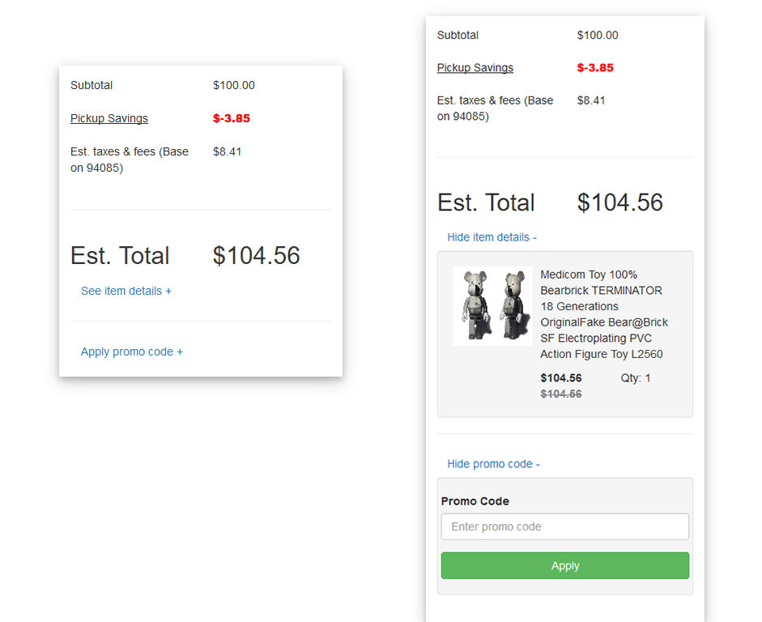

# The goal of this exercise is to build a “Purchase Summary” user interface using React. 

Key UI element:

- The “Pickup saving” tooltip
- The “See Item detail” expander
- The “Apply Promo code” expander

The user should be able to enter a promo code “DISCOUNT” and on applying it, see a 10% discount reflect in the purchase summary. Use Redux for this.

Please refrain from using existing react components out there to help building this. For the pricing data, you can hard code it to an object/json and read from it.

Reusability of component is a key factor to consider. You’ll be evaluated based on code correctness and quality.

